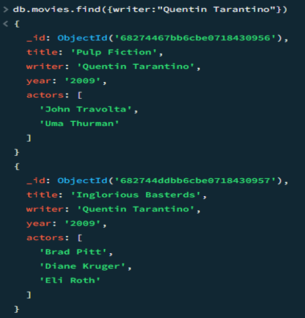

# Finals Lab Task 6.  MOngoDBCRUD
In this task, I learned that MongoDB is a NoSQL database that stores data in flexible, JSON-like documents instead of traditional relational tables. It’s designed to handle unstructured or semi-structured data, with collections that don’t require a fixed schema. MongoDB also offers features like horizontal scaling, indexing, and an aggregation framework, making it suitable for high-performance, dynamic applications.     
      
Here are the tasks that were provided and the code for the MongoDB:

## Part 1. MongoDB Exercise in Mongo shell
- **Create database**
Connect to a running mongo instance, use a database named `mongo_practice`

  
- **Insert the following documents into a `movies` collection:**

  
title : Fight Club  
writer : Chuck Palahniuk  
year : 1999  
actors : [
  Brad Pitt
  Edward Norton
]
  
  
title : Pulp Fiction
writer : Quentin Tarantino
year : 1994
actors : [
  John Travolta
  Uma Thurman
] 
  

title : Inglorious Basterds
writer : Quentin Tarantino
year : 2009
actors : [
  Brad Pitt
  Diane Kruger
  Eli Roth
]

title : The Hobbit: An Unexpected Journey
writer : J.R.R. Tolkein
year : 2012
franchise : The Hobbit

title : The Hobbit: The Desolation of Smaug
writer : J.R.R. Tolkein
year : 2013
franchise : The Hobbit

title : The Hobbit: The Battle of the Five Armies
writer : J.R.R. Tolkein
year : 2012
franchise : The Hobbit
synopsis : Bilbo and Company are forced to engage in a war against an array of combatants and keep the Lonely Mountain from falling into the hands of a rising darkness.

title : Pee Wee Herman's Big Adventure

title : Avatar  

- **Query / Find Documents**
1. get all documents  
**INPUT:**  

  
**OUTPUT:**  
        

2. get all documents with `writer` set to "Quentin Tarantino"  
**INPUT:**  
    
    
**OUTPUT:**  
  

3. get all documents where `actors` include "Brad Pitt"  
**INPUT:**  

  
**OUTPUT:**  
  
4. get all documents with `franchise` set to "The Hobbit"     
   
**INPUT:**  
    
       
**OUTPUT:**   
  
5. get all movies released in the 90s      

**INPUT:**  
  
   
**OUTPUT:**   
  
6. get all movies released before the year 2000 or after 2010          

**INPUT:**  
    
   
**OUTPUT:**   
    

- **Update Documents**
1. add a synopsis to "The Hobbit: An Unexpected Journey" : "A reluctant hobbit, Bilbo Baggins, sets out to the Lonely Mountain with a spirited group of dwarves to reclaim their mountain home - and the gold within it - from the dragon Smaug."  
**CHANGE:**   

      
**INPUT:**
db.movies.update({title: "The Hobbit An Unexpected Journey"}, {$set: {synopsis: "A reluctant hobbit, Bilbo Baggins, sets out to the Lonely Mountain with a spirited group of dwarves to reclaim their mountain home and the gold within it - from the dragon Smaug."}})
          
**OUTPUT:**  
  
     
2. add a synopsis to "The Hobbit: The Desolation of Smaug" : "The dwarves, along with Bilbo Baggins and Gandalf the Grey, continue their quest to reclaim Erebor, their homeland, from Smaug. Bilbo Baggins is in possession of a mysterious and magical ring."       
    
**CHANGE:**          
    
       
**INPUT:**         
db.movies.update({title: "The Hobbit: The Desolation of Smaug"}, {$set: {synopsis: "The dwarves, along with Bilbo Baggins and Gandalf the Grey, continue their quest to reclaim Erebor, their homeland, from Smaug. Bilbo Baggins is in possession of a mysterious and magical ring."}})   
                      
**OUTPUT:**          
    
    
3. add an actor named "Samuel L. Jackson" to the movie "Pulp Fiction"  
**CHANGE:**   
      
            
**INPUT:**      
db.movies.update({title: "Pulp Fiction"}, {$push: {actors: "Samuel L. Jackson"}})
                   
**OUTPUT:**           
    
                                  
- **Text Search**      
1. find all movies that have a synopsis that contains the word "Bilbo"  
**INPUT:**   

     
**OUTPUT:**     
  
2. find all movies that have a synopsis that contains the word "Gandalf"   

**INPUT:**   
  
    
**OUTPUT:**   
  
3. find all movies that have a synopsis that contains the word "Bilbo" and not the word    
**INPUT:**    
   
    
**OUTPUT:**    
  
4. find all movies that have a synopsis that contains the word "dwarves" or "hobbit"       
**INPUT:**  
   
    
**OUTPUT:**     
   
5. find all movies that have a synopsis that contains the word "gold" and "dragon"   
**INPUT:**   
   
      
**OUTPUT:**     
   

- **Delete Documents**   
1. delete the movie "Pee Wee Herman's Big Adventure"   
**INPUT:**    
   
      
**OUTPUT:**  
  
2. delete the movie "Avatar"           
**INPUT:**    
   
      
**OUTPUT:**    
  
  
- **Relationships**       

**Insert the following to <code>user</code> collection. **
**INPUT:*** <code>db.users.insertMany([{ _id: 1, username: "GoodGuyGreg", first_name: "Good Guy", last_name: "Greg" }, { _id: 2, username: "ScumbagSteve", full_name: { first: "Scumbag", last: "Steve" } }])</code>

  
     
**OUTPUT**:      
  

**Insert the following documents into a <code>posts</code> collection.**          
**INPUT:*** <code>db.comments.insertMany([{ username: "GoodGuyGreg", comment: "Hope you got a good deal!", post: ObjectId("68282cda172fd1a7fdf6f2") }, { username: "GoodGuyGreg", comment: "What's mine is yours!", post: ObjectId("68282cec172fd1a7fdf6f6") }, { username: "GoodGuyGreg", comment: "Don't violate the licensing agreement!", post: ObjectId("68282cf0172fd1a7fdf6f7") }])</code>

  

  
  

  
  
**Insert the following documents into a <code>comments</code> collection. **       
**INPUT:***   <code>
db.comments.insert({username:"GoodGuyGreg", comment:"Hope you got a good deal!", post:ObjectId("5ca0b7e96435f98b5901f463")}); 
db.comments.insert({username:"GoodGuyGreg", comment:"What's mine is yours!", post:ObjectId("5ca0b9706435f98b5901f46a")}); 
db.comments.insert({username:"GoodGuyGreg", comment:"Don't violate the licensing agreement!", post:ObjectId("5ca0b8766435f98b5901f467")}); 
db.comments.insert({username:"ScumbagSteve", comment:"It still isn't clean", post:ObjectId("5ca0b8546435f98b5901f466")}); 
db.comments.insert({username:"ScumbagSteve", comment:"Denied your PR cause I found a hack", post:ObjectId("5ca0b9256435f98b5901f469")});
</code>

  

  
  

 **OUTPUT**: 
 

 
